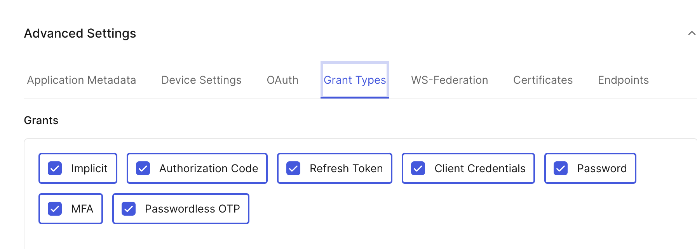

# Standalone MFA with Auth0

This is plain vanilla **JavaScript** and **HTML** sample implementation of a standalone MFA scenario using **Okta Customer Identity Cloud (Auth0)**.

**Scenario:**
The application uses its own login process. After primary authentication, it calls Auth0 API for MFA and obtains Auth0 ID and access tokens. In the sample, primary authentication is done from `users.json` file that holds user credentials. In practical use cases, it would possibly use an LDAP, database, or a legacy identity provider.

## Deploy Sample Application

* Install [Node.js](https://nodejs.org/en/download/) on the system

* Move to the App directory and download dependencies

    ```
	cd Standalone-MFA/
	
	npm install
	
	```

## Generate keypair for a signed token

* Move to the App directory 
	
	```
	cd Standalone-MFA/
	```

* Run the key generation script 

	```
	node genkey.sh
	```
	
	This will generate the key files `keys.json` and `publickey.json`. 
	
	**Note**: The public key details from `publickey.json` are needed for Auth0 configuration.


## Configure Auth0 connection

Create a database connection in Auth0 -

* **Name:** standalone-mfa
* **Requires Username:** Disabled
* **Import Users to Auth0:** Disabled
* **Use my own database:** Enabled
* **Database Action Scripts: Login:**

```
async function login(email, password, callback) {
  const request = require('request');
  var jose = require('node-jose');
  try{
  const pkey = JSON.parse(configuration.pkey);
  let key = await jose.JWK.asKey(pkey);
  let result = await jose.JWS.createVerify(key).verify(password);
  const claims = JSON.parse(result.payload);
  if (claims.exp < Math.floor(Date.now() / 1000)){
     callback(new Error("Expired token"));
  }
    
  if (claims.username !== email){
     callback(new Error("Subject does not match"));
  }
   
    callback(null, {
    	user_id: email,
    	nickname: email,
    	email: email,
    	result: JSON.stringify(claims)
   });
  }catch (err){
    callback(err);
  }  
}
```

* **Database Settings:** Create a key `pkey` with public key value from the file ``publickey.json`


## Configure Auth0 Application

* Create a regular web application. Note the `client ID` and `client secret`.

* Under the **Advanced Settings** ensure that the `Password` and `MFA` grants are enabled.



* Under the **Connections** settings, enable `standalone-mfa` connection for the application.


## Configure Sample Application

* Move to the App directory 
	
```
cd Standalone-MFA/
```

* Create a file `.env` creating a copy from `env.template`

```
cp env.template .env
```

* Fill the `.env` file -

```
tokenUrl = 'https://******/oauth/token'
mfaUrl = 'https://******//mfa/challenge'
clientId =  ''
clientSecret = ''
connection = 'standalone-mfa'
authenticatorId = ''
```

* Create a file `users.json` creating a copy from `users.json.template`

```
cp users.json.template users.json
```

* Fill the `users.json` file with the test email address and passwords. 

```
[
  { 
        "username": "user1@example.com", 
        "password": "password"
    },
    { 
        "username": "user2@example.com", 
        "password": "password"
    }
]
```


* Run the application

```
node app.js
```

* Access the application at - [http://localhost:3000](http://localhost:3000)

* Login with one of the users in `users.json` file.